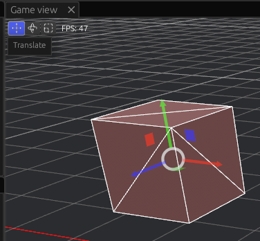
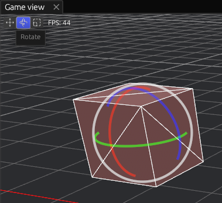
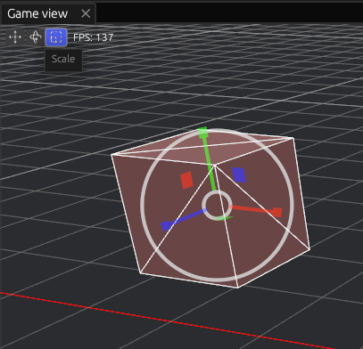

space_editor is useful tool for scene/prefab/prototyping with bevy engine.  Its allow to create/modify levels/scenes/prefabs in fast gui based way.

## Main features

- **Intuitive Scene and Prefab Management**: Space Editor allows you to prepare and save scenes and prefabs with an intuitive user interface. You can easily reuse them in your game development workflow. 
- **bevy_xpbd_3d compatibility**: Space Editor supports bevy_xpbd_3d, including all editor features. 
- **Gizmo-Based manipulations**: Manipulate entity positions, rotations, and scales using gizmos. 
- **Component values editing**: Easily edit component parameters within the editor UI 
- **Seamless Editor-Game switching**: Switch between the editor UI and the game effortlessly for fast prototyping and testing. 
- **Prefab Reusability**: Prefabs can be nested within other prefabs, improving reusability and organization in your projects. 
- **Many custom components**: Space Editor implements various custom components to seamlessly integrate its saving system with the standard Bevy scene format. 
- **Easy API for customization**: Customize or register your own components within the editor with ease, tailoring it to your specific project needs.
- **Event dispatching**: Send custom events directly from the editor UI for easier gameplay debugging. 
- **API for adding tabs**: Extend the functionality of the editor by easily adding new tabs, enhancing your workflow. 

# Editor UI

For a quick overview of the editor's user interface and keyboard shortcuts, please refer to the [shortcuts.md](/docs/shortcuts.md) file.

The Editor UI is built upon the [edui_dock](https://github.com/Adanos020/egui_dock) crate. It offers a highly flexible and efficient way to interact with your Bevy projects. Here are some key features of the Editor UI:

## Tab-Based Organization

Most editor features are implemented as tabs within the dock system, providing a structured and organized workspace. You can easily manage these tabs to suit your workflow:

- **GameView Tab**: This tab displays the rendered output from the editor camera and gizmos for manipulate objects.
  - On the top left side of the Gameview you will find some relevant information like frames per second cound (FPS), available editor tools and the selected tool options.
  - Currently the only available tool is Gizmo.

- **Hierarchy Tab**: The Hierarchy tab provides comprehensive information about all entities within your prefab. It not only displays entity details but also allows you to perform various actions:
  - Create new entities
  - Delete or clone existing entities (Right click on the entity)
  - Add child entity to existing entity.
  - Clear scene from all entities button.
  - Spawn [bundles](#bundles) (entities with preset components) for quick scene setup.

- **Inspector Tab**: The Inspector tab is your go-to place for inspecting and modifying components and their values. It empowers you to:
  - View detailed information about each component
  - Manipulate component values
  - Add or remove components as needed.
 
### Gizmos
- The gizmos tool contains (from left to right):
  - Translation option, that allows you to change the position of an object in the scene.

  

  - Rotation option, that allows you to change the orientation of an object in the scene.

  

  - Scale option, that allows you to change the size of an object in the scene.

  

> OBS: To apply a gizmos to multiple selected entities **holding SHIFT** is required

### Additional Tabs

> Additional tabs can be found by pressing `+` next to the existing tabs. Docking system is available to move tabs to your prefered position.

- **Settings Tab**: Your place to configure and customize the editor as you wish.
  - Undo chain size condiguration.
  - Hotkeys configuration
  - New tab spawning behavior:
    - **Same Node**: Adds the new tab as part of the current node.

    
    - **New Window**: Creates a new floating window containing the tab.

    
    - **Split Node**: Splits node in half.

     

- **Resources Tab**: An inspector like tab to manage your resources data.
- **Debug World Inspector Tab**: An all in one tab.:
  - Manages Entities, including editor entities, and their components.
  - Resources tab.
  - Assets tab, currently the only way to access assets.

> Tabs organization is persisted

## Dock System Flexibility

The dock system in the Editor UI offers a high degree of flexibility:

- You can easily move tabs around, grouping them as necessary.

- Tabs can be hidden using the 'x' button, and you can reopen closed tabs with the '+' button, ensuring a clutter-free workspace.

- For added convenience, tabs can also be detached from the main dock system and placed in subwindows, allowing you to arrange your workspace exactly the way you prefer.

## Menu Toolbars

### Bottom menu


Bottom menu is panel with settings for current scene. It contains:

- "Clear Entities" button to remove all user added entities
- "Add Entity" button to add a new empty entity to the scene
- "Spawn Bundle" button to spawn a pre configured bundle in the scene:
  - 2D and 3D Meshes
  - 2D and 3D Cameras
  - Light
  - Sprites
- "Show editor entities" checkbox to show all editor hidden entities
- "Current Scene", label with the current scene name and path

### Top Menu


Top menu is panel with scene management options. It contains:

- Folder button to open file dialog to select prefab
- "Save" button to save scene manually in file dialog
- "Load" button to load scene from from file dialog
- "Open GLTF" button to load a GLTF/GLB as prefab
- Play button to starty play game

# Customization

## Register new component

Custom types can be added to the editor gui and prefab spawn system with just a single line:

```rs
use editor::prelude::EditorRegistryExt;

app.editor_registry::<Name>();
```

The representation of components in the editor UI can also be customized by bevy_inspector_egui library.

## Register new event

Custom Events can be added to the editor UI with the following:

```rs
#[derive(Event, Default, Resource, Reflect, Clone)]
#[reflect(Resource)]
pub struct Name;

use editor::prelude::EditorRegistryExt;

app.editor_registry_event::<Name>();
```

One limitation is that events must implement `Event, Default, Resource, Reflect, Clone`, with `Resource` reflected. Once registered, events can be sent using the `Event Dispatcher` tab.

> Obs: editor already handles internally objects registration and initialization:
> 
> `register_type::<T>() and init_resource::<T>()`

> To disable this, use feature `no_event_registration`.

## Bundles

Bundles in the Space Editor are predefined sets of components that simplify the creation of entities. When a bundle is spawned by button clicking in ui, the editor automatically generates a new entity with the components specified in the bundle. To make bundles accessible in the editor UI, you can register them using the `app.editor_bundle(category, name, bundle_components_set)` method. All bundles are showen in down of Heirarchy tab.

### Example: Adding a Cube Mesh Bundle

This example demonstrates how to add a bundle for a cube mesh:

```rust
app.editor_bundle("Mesh", "Cube", (
	MeshPrimitivePrefab::Cube(1.0),
	Name::new("Cube".to_string()),
	Transform::default(),
	Visibility::default()
));
```

And after call method, "Cube" bundle can be acessed in UI


## Add New Tab to Editor UI

In space_editor, you have two methods for adding new tabs to the editor user interface:

### Trait-Based Tab

Trait-based tabs are implemented by conforming to the `EditorTab` trait. These tabs provide full access to the Bevy world, enabling you to perform various tasks within the editor. To create a trait-based tab, you need to implement two functions:

1. `fn ui(&mut self, ui: &mut egui::Ui, world: &mut World)`: This function is responsible for rendering the tab's content. It grants you access to the Bevy world for any necessary operations.

2. `fn title(&self) -> egui::WidgetText`: Use this function to set the title of your tab.

To register a trait-based tab, follow this syntax:

```rust
app.editor_tab_by_trait(EditorTabName::Other(your_tab_id_string), your_tab);
```

### System-Based Tab

System-based tabs are another way to define tabs. You can create a tab from a Bevy system that utilizes the `EditorUiRef` non-send resource to display its content. This method provides a straightforward way to access world data for your tab. For example, you can create a tab using the following system:

```rust
fn simple_tab_system(mut ui : NonSendMut<EditorUiRef>) {
    let ui = &mut ui.0;
    ui.label("Hello editor");
}
```

To register a system-based tab, you can use this syntax:

```rust
app.editor_tab(EditorTabName::Other("simple_tab".to_string()), "Simnple tab".into(), simple_tab_system)
```

Result:


These approaches allow you to extend the space_editor's functionality by adding custom tabs tailored to your specific needs.


# Contribution

# Code structure

Space editor code contains three main parts:
- Src: This is where the editor executable and the library prelude are located, it is also a goo place to add your game specific code.
- Modules: This are community created modules, and they serve as wrappers to crates or as space_editor own game oriented crates
  - bevy_xpbd_plugin: A plugin that wraps bevy_xpbd_3d crate.
  - MORE TO COME!
- Crates: This are space_editor spacific workspace crates and the main ones are:
  - Editor (crates/editor/): contains main editor UI
  - EditorCore (crates/editor_core/): contains editor core functionality like loading/saving/game start
  - Prefab (crates/prefab/): contains prefab logic and components and can be used separately from EditorUI or EditorCore, this is the plugin that your game need to use to load prefabs
  - Shared (crates/shared): Components, Events, Resources and Systems that are shared between all editor crates and modules
  - undo (crates/undo): Crate responsible for managing the systems that handle editor undo functionality.
- Examples: Some community based examples

## Dependencies

The project relies on the following crates:

- **bevy-egui**: Used for rendering the editor UI.
- **bevy-inspector-egui**: Enables the display and management of component values.
- **bevy_infinite_grid**: Provides the means to display an infinite grid as a background.
- **bevy_mod_picking**: Allows for object selection via mouse clicks.
- **bevy_panorbit_camera**: Facilitates intuitive camera control within the editor.
- **bevy-scene-hook**: Conveniently marks scene objects and enables their hiding in the editor.
- **bevy_xpbd**: Used for physics calculations and simulation.
- **egui_dock**: Implements a sophisticated dock system for editor ui.
- **egui_file**: Used for displaying a file dialog.
- **egui-gizmo**: Provides easy to use Gizmo UI helpers 
- **ron**: Handles ron serialization from settings and prefabs.
- **serde**: Handles serialization visitor. 

# Version policy

- **0.0.xx**: This version format is reserved for bug fixes or minor changes that do not impact the code API significantly. It is suitable for addressing issues without introducing major alterations.
- **0.xx.0**: Versions in this format encompass changes that are not considered minor. This may include new features, enhancements, or modifications that have a more significant impact on the codebase or functionality.
- **xx.0.0**: This version format is reserved for breaking changes that fundamentally alter the project's structure or behavior. It signifies major updates that may require code adjustments, so be prepared for substantial modifications when transitioning to this version.
